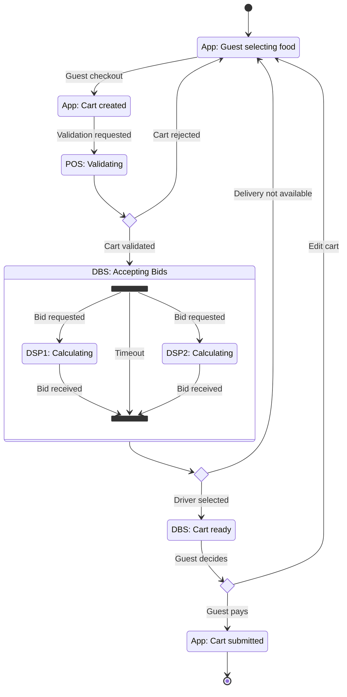
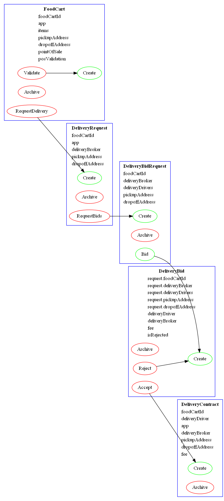

# Daml Sample Project

## Domain Description

This project is roughly based on the domain of restaurant food delivery.

1. The guest selects their food on the ordering website and then starts the checkout process.
1. The point of sale machine (POS) at the restaurant:
   * confirms that the items are available
   * calculates the subtotal of the cart
   * calculates the tax.
1. A delivery broker service (DBS) publishes a request for bids to the local delivery service providers (DSPs).
1. The DSPs respond to the request for bids.
1. The DBS selects one of the DSPs (based on the least fee and/or soonest delivery time.)
1. The guest sees the final pricing, taxes, delivery fees, and delivery time. The guest confirms the order.

## Domain State Diagram



## Daml Contract Visualization

This diagram was generated using [this technique](https://docs.daml.com/tools/visual.html).



## Observations

* The documentation is awesome.
* The VS Code extension is a huge help.
* The first impression of tooling is very positive. (`daml version` displayed the latest release; `daml install 2.3.4` downloaded the latest release; side-by-side installation of different versions, the script results view in "Daml Studio", etc.)
* F# did a good job preparing me.
* As I thought more about the domain and as I refactored the Daml code, the solution became simpler and more correct.
* I tried to refactor a module into separate modules, but that created a cyclic reference (as I expected), which is not allowed (as I learned.)

## Questions

* Are clients using this to persist data that is not really required for the contract?

* When to create a template with an Optional member that gets set by a choice... and when to just create a second template? (e.g., FoodCart.Validate)

* Can a choice create two contracts (e.g., Accepting a bid should should create the DeliveryContract _and_ archive the DeliveryBidRequest)

## Improvements?

* The VS Code Snippet for `choice` could be improved (to match some of the samples in the tutorials)
* Allow | character before the first value of sum types (purely for eye-candy and to match my F# background.)

    ```daml
    data PosValidation =
        | Valid with price : Decimal
        | Invalid with msg : Text
    ```  

* The wording of the warning "`The import of SomeModule is redundant...`" confused me at first. Would it be better phrased as "`The import of SomeModule is unnecessary...`" or "`...unused...`"

* When building in the command line, I saw [redundant error messages for the same error](./redundant-error-msgs.png).

* When viewing error messages on the command line, [my Windows PowerShell Core terminal did not respect some of the character codes](./unrespected-char-codes.png).

* It would be nice if [script error messages were available on the script results page](./error-msg-in-script-results.png).

* Submitted [a PR to the docs](https://github.com/digital-asset/daml/pull/14924) regarding the new "[Visualizing Daml Contracts](https://docs.daml.com/tools/visual.html)" feature.
